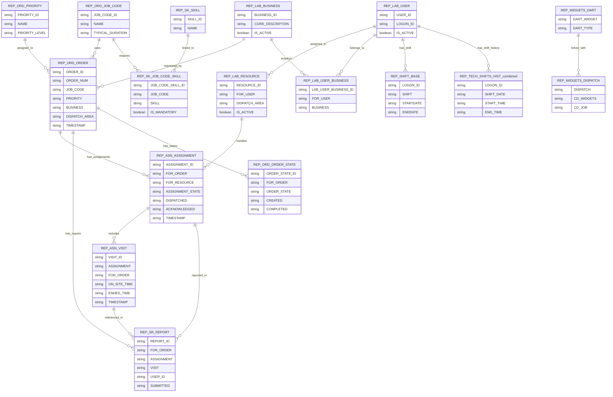

```mermaid
erDiagram
    %% --- Entities ---
    REP_ORD_ORDER {
        string ORDER_ID
        string ORDER_NUM
        string JOB_CODE
        string PRIORITY
        string BUSINESS
        string DISPATCH_AREA
        string TIMESTAMP
    }
    REP_ORD_JOB_CODE {
        string JOB_CODE_ID
        string NAME
        string TYPICAL_DURATION
    }
    REP_ORD_PRIORITY {
        string PRIORITY_ID
        string NAME
        string PRIORITY_LEVEL
    }
    REP_LAB_BUSINESS {
        string BUSINESS_ID
        string CORE_DESCRIPTION
        boolean IS_ACTIVE
    }
    REP_ASN_ASSIGNMENT {
        string ASSIGNMENT_ID
        string FOR_ORDER
        string FOR_RESOURCE
        string ASSIGNMENT_STATE
        string DISPATCHED
        string ACKNOWLEDGED
        string TIMESTAMP
    }
    REP_ASN_VISIT {
        string VISIT_ID
        string ASSIGNMENT
        string FOR_ORDER
        string ON_SITE_TIME
        string ENDED_TIME
        string TIMESTAMP
    }
    REP_LAB_RESOURCE {
        string RESOURCE_ID
        string FOR_USER
        string DISPATCH_AREA
        boolean IS_ACTIVE
    }
    REP_LAB_USER {
        string USER_ID
        string LOGON_ID
        boolean IS_ACTIVE
    }
    REP_SR_REPORT {
        string REPORT_ID
        string FOR_ORDER
        string ASSIGNMENT
        string VISIT
        string USER_ID
        string SUBMITTED
    }
    REP_ORD_ORDER_STATE {
        string ORDER_STATE_ID
        string FOR_ORDER
        string ORDER_STATE
        string CREATED
        string COMPLETED
    }
    REP_SK_SKILL {
        string SKILL_ID
        string NAME
    }
    REP_SK_JOB_CODE_SKILL {
        string JOB_CODE_SKILL_ID
        string JOB_CODE
        string SKILL
        boolean IS_MANDATORY
    }
    REP_LAB_USER_BUSINESS {
        string LAB_USER_BUSINESS_ID
        string FOR_USER
        string BUSINESS
    }
    REP_WIDGETS_DART {
        string DART_WIDGET
        string DART_TYPE
    }
    REP_WIDGETS_DISPATCH {
        string DISPATCH
        string CD_WIDGETS
        string CD_JOB
    }
    REP_SHIFT_BASE {
        string LOGON_ID
        string SHIFT
        string STARTDATE
        string ENDDATE
    }
    REP_TECH_SHIFTS_HIST_combined {
        string LOGON_ID
        string SHIFT_DATE
        string START_TIME
        string END_TIME
    }

    %% --- Relationships ---
    REP_ORD_JOB_CODE ||--o{ REP_ORD_ORDER : "uses"
    REP_ORD_PRIORITY ||--o{ REP_ORD_ORDER : "assigned_to"
    REP_LAB_BUSINESS ||--o{ REP_ORD_ORDER : "requested_by"
    REP_ORD_ORDER ||--o{ REP_ASN_ASSIGNMENT : "has_assignments"
    REP_LAB_RESOURCE ||--o{ REP_ASN_ASSIGNMENT : "handles"
    REP_ASN_ASSIGNMENT ||--o{ REP_ASN_VISIT : "includes"
    REP_ASN_ASSIGNMENT ||--o{ REP_SR_REPORT : "reported_in"
    REP_ASN_VISIT ||--o{ REP_SR_REPORT : "referenced_in"
    REP_ORD_ORDER ||--o{ REP_SR_REPORT : "has_reports"
    REP_ORD_ORDER ||--o{ REP_ORD_ORDER_STATE : "has_states"
    REP_SK_SKILL ||--o{ REP_SK_JOB_CODE_SKILL : "linked_to"
    REP_ORD_JOB_CODE ||--o{ REP_SK_JOB_CODE_SKILL : "requires"
    REP_LAB_USER ||--o{ REP_LAB_RESOURCE : "assigned_to"
    REP_LAB_USER ||--o{ REP_LAB_USER_BUSINESS : "belongs_to"
    REP_LAB_BUSINESS ||--o{ REP_LAB_USER_BUSINESS : "employs"
    REP_LAB_USER ||--o{ REP_SHIFT_BASE : "has_shift"
    REP_LAB_USER ||--o{ REP_TECH_SHIFTS_HIST_combined : "has_shift_history"
    REP_WIDGETS_DART ||--o{ REP_WIDGETS_DISPATCH : "linked_with"
```
